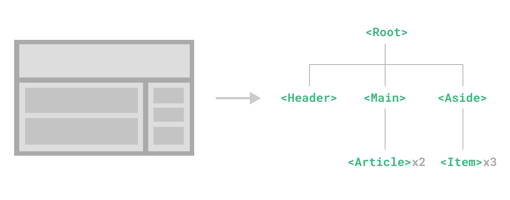

# Components Basics

Các thành phần cho phép chúng ta chia giao diện người dùng thành các phần độc lập và có thể tái sử dụng, và nghĩ về mỗi phần một cách độc lập. Thông thường, một ứng dụng được tổ chức thành một cây các thành phần lồng nhau:

## Defining a Component
Xem file DefiningAComponent.vue